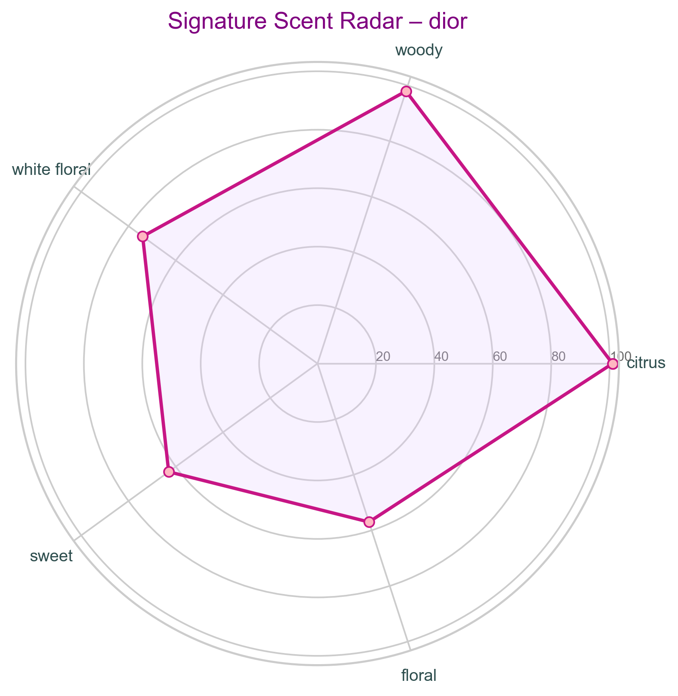
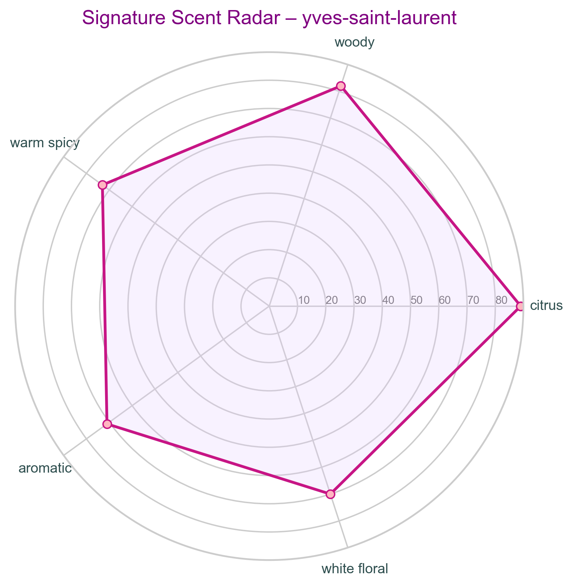

# Signature Scent Analysis — Designer Fragrances
### 📌 Project Overview

This project analyzes signature scent profiles of major designer fragrance brands using data analytics and visualization. By examining dominant fragrance accords across top, middle, and base notes, the project uncovers how brands express identity, positioning, and target impressions through scent composition.
This analysis bridges data analysis and business insight, demonstrating how fragrance data can be translated into branding and market strategy.

### 🎯 Project Objectives
- Identify dominant fragrance accords per brand
- Understand how scent composition reflects brand positioning
- Compare signature scent profiles across designer brands
- Translate analytical findings into actionable business insights

### 🧪 Dataset Description

The dataset contains designer fragrance information, including:
Brand
- Gender (Men, Women, Unisex)
- Top, Middle, and Base Notes
- Main fragrance accords
- Each fragrance may contain multiple notes and accords, which were transformed using data normalization techniques for accurate analysis.

### 🛠️ Tools & Technologies
Python
- Pandas & NumPy – data preparation and transformation
- Matplotlib & Seaborn – data visualization
- Jupyter Notebook – exploratory data analysis and storytelling

## 📊 Key Analysis & Visual Outputs
### Fragrance Pyramid Analysis by Gender

The figure below summarizes fragrance composition across the fragrance pyramid (top, middle, and base notes) segmented by gender.
This visualization highlights how scent structures are tailored to different target audiences throughout the wear lifecycle.


**Insight:**  
Men’s fragrances emphasize fresh and aromatic openings, women’s fragrances highlight floral richness in the heart, while base notes across genders converge on woody and musky accords to support longevity and depth.

### Signature Scent Analysis by Brand
This section presents brand-level signature scent profiles using radar charts.
Each chart represents a brand’s olfactory fingerprint based on dominant fragrance accords.


### Dior — Bold Citrus & Woody



**Insight:**  
Dior’s strong citrus dominance combined with woody and floral notes creates a bold, confident, and high-impact scent profile that reinforces its premium and expressive brand positioning.

### Yves Saint Laurent — Warm, Spicy & Modern



**Insight:**  
YSL’s scent profile balances citrus freshness with warm spicy and aromatic accords, reinforcing its edgy, modern, and seductive brand positioning.


#### 🧠 Key Findings & Insights
- Brands use scent composition as a strategic branding tool, not randomly
- Fresh and woody accords dominate mass-market and unisex positioning
- Floral, gourmand, and spicy profiles are used to differentiate and create bold brand statements
- Signature scent consistency strengthens brand recognition and emotional connection

#### 💼 Business Implications
Product Development: Ensures new fragrance launches align with brand DNA
Brand Strategy: Helps maintain consistent olfactory identity
Market Opportunity: Identifies gaps for niche or hybrid scent profiles
Marketing & Storytelling: Data-backed scent narratives enhance campaign effectiveness

## 📁 Project Structure
```text
├── data/
│   └── fragrantica.csv          # Dataset utama
├── images/
├── notebooks/
│   └── perfume_notes_analysis.ipynb  # Analisis utama
└── README.md
```

### 🚀 How to Run
```
git clone https://github.com/RezaH-art/perfume-designer-analysis.git
cd signature-scent-analysis
jupyter notebook
```
## 👤 Author

**Reza Habibulloh**  
📍 Data Analyst & Data Engineer  
📌 Portfolio project focused on data-driven insights in lifestyle and luxury branding

📬 **Contact & Connect**  
🔗 LinkedIn: https://www.linkedin.com/in/rezahabibulloh/  
📧 Email: reza.habibulloh@example.com  
💻 GitHub: https://github.com/RezaH-art  
🌐 Portfolio: https://rezah-art.github.io
